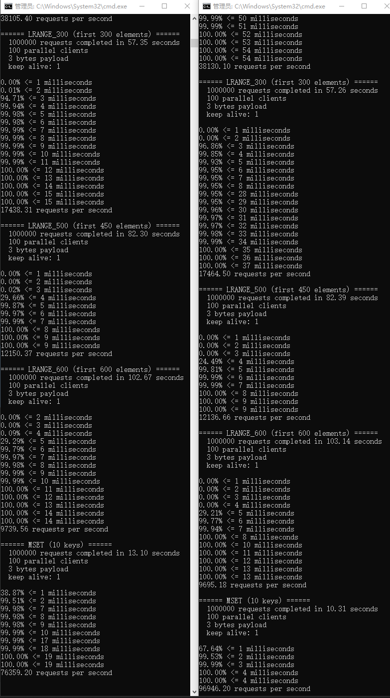

#  EF-Redis  

## 介绍

ef-Redis是java 版本的redis server

命令：仅支持服务连接与五大基本类型相关的命令

存储：仅支持AOF日志

多路复用：支持 epoll，kqueue，select 默认优先级由高到低，同时支持本地和单路复用

强烈推荐使用单路select线程模型
#### 解决问题

1,启动简单，方便测试

2,解除喜欢刨根问底的开发者，对大厂面试官面试redis相关问题的迷惑侧重点的迷惑

3,为redis proxy 开发提供技术参考

#### EF-Redis功能介绍

支持服务间的消息传递和数据共享

#### EF-Redis架构简介

集群架构方式：客户端路由

见作者知乎文档：

[微服务集群架构实现一览](https://zhuanlan.zhihu.com/p/368407754)

####  EF-Redis涉及技术

1,Netty

####  EF-Redis开发框架

Java+Netty

####  EF-Redis入门知识
1，Java基础

b站搜索 “韩顺平java”

2，Netty基础

b站搜索 “韩顺平netty”

3，redis tcp 协议

[RESP协议中文文档](https://www.redis.com.cn/topics/protocol.html)

[REDIS命令大全](https://www.redis.com.cn/commands.html)

[ef-redis 源码解析](https://zhuanlan.zhihu.com/p/434698347)

####  EF-Redis启动步骤

idea内部直接启动MyRedisServer

jar运行方式 ，参见ef-zab

####  EF-Redis AOf持久化演示

####  EF-Redis 如何连接？

redis-client 或者 redis-desktop-manager 都可以

###  EF-Redis 压测结果

####  秒吞吐量

同样资源下 EF-Redis秒吞吐量是Redis的80%-95%

####  延迟

EF-Redis，与Redis相当

java版 Redis 请求耗时略逊于  C++版 Redis

redis-benchmark 在代码根目录中
测试命令： redis-benchmark.exe -h 127.0.0.1 -p 6378 -c 100 -n 1000000

| 命令                                 | C++ 版 QPS | C++ 版 3 毫秒占比 | Java 版 QPS | Java 版 3 毫秒占比 | 性能对比（Java/C++） |
| ---------------------------------- | --------- | ------------ | ---------- | ------------- | -------------- |
| PING\_INLINE                       | 100030.01 | 100.00%      | 103156.59  | 100.00%       | 103.13%        |
| PING\_BULK                         | 100030.01 | 100.00%      | 102322.73  | 100.00%       | 102.29%        |
| SET                                | 100381.45 | 99.98%       | 102061.64  | 100.00%       | 101.67%        |
| GET                                | 98068.06  | 99.99%       | 101864.11  | 100.00%       | 103.87%        |
| INCR                               | 101214.57 | 100.00%      | 101905.64  | 100.00%       | 100.68%        |
| LPUSH                              | 99522.29  | 99.99%       | 83836.35   | 99.88%        | 84.24%         |
| RPUSH                              | 71880.39  | 100.00%      | 98020.00   | 99.96%        | 136.37%        |
| LPOP                               | 68917.98  | 99.99%       | 75007.50   | 99.92%        | 108.83%        |
| RPOP                               | 69084.62  | 100.00%      | 75740.36   | 99.96%        | 109.63%        |
| SADD                               | 69925.18  | 100.00%      | 104351.45  | 100.00%       | 149.23%        |
| HSET                               | 70363.07  | 100.00%      | 102764.36  | 100.00%       | 146.05%        |
| SPOP                               | 69851.91  | 100.00%      | 75585.79   | 99.96%        | 108.21%        |
| LPUSH (needed to benchmark LRANGE) | 84803.26  | 100.00%      | 77802.85   | 99.98%        | 91.74%         |
| LRANGE\_100 (first 100 elements)   | 38105.40  | 100.00%      | 38130.10   | 99.89%        | 100.06%        |
| LRANGE\_300 (first 300 elements)   | 17438.31  | 100.00%      | 17464.50   | 99.97%        | 100.14%        |
| LRANGE\_500 (first 450 elements)   | 12150.37  | 100.00%      | 12136.66   | 100.00%       | 99.97%         |
| LRANGE\_600 (first 600 elements)   | 9739.56   | 100.00%      | 9695.18    | 100.00%       | 99.54%         |
| MSET (10 keys)                     | 76359.20  | 99.99%       | 96946.20   | 99.99%        | 126.96%        |
| 合计值平均值                             | 78491.85  | -            | 90741.41   | -             | 115.60%        |

上图为豆包生成，感谢字节公司的工人朋友们开发出这么好的免费软件

左侧为C++版本redis ，右侧为Java 版本redis

➕ v 一起交流互联网

####  凭什么？

凭什么Java版本redis性能可以超越C++redis 15%？

##### 1，最新版本营销性能的改动有哪些？
    1.1 NioEventLoopGroup指定单线程的线程池，并设置RingBlockingQueue。
    1.2 ServerBootstrap指定了池化消息内存内存池
    1.3 修改了最大帧大小，netty最大支持int最大值的大小帧，256mb,小于c++ redis版本的500mb，c++支持最大值500mb是因为c++支持无符号int
        索性当前版本支持最大值的大小帧大小改为了50mb，设置太大jvm会频繁垃圾回收等操作，印象接口耗时稳定性

##### 2，自定义scsp堵塞队列：
    RingBlockingQueue开发意图原本是aof日志专用的单线程写单线程读的堵塞队列。
    2.1 ，为什么自己开发，不用开源的？
        java并没有scsp专用的堵塞队列，因为JCtools有开源的scsp堵塞队列，并没有实现BlockingQueue接口，而且性能并不好。
        RingBlockingQueue用到了连续内存页技术，读写内存更快，内存预申请，是Java自带堵塞队列性能的10倍以上。
##### 3，差异
    3.1 CPP Redis 5.0 版本用的是nio epool模型，EF-Redis 用的是 select 模型，在连接数100 这个量级，select优势更大一些
    3.2 CPP Redis 5.0 最大帧支持500mb，EF-Redis 支持 50mb
##### 4，这还没完
    分支中有操作命令无gc的版本，gc分支合并master分支后，有望性能在提升2%左右

