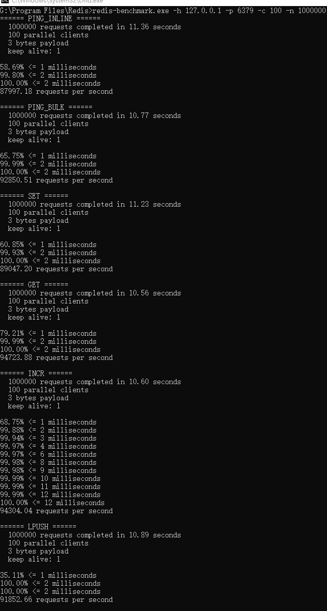
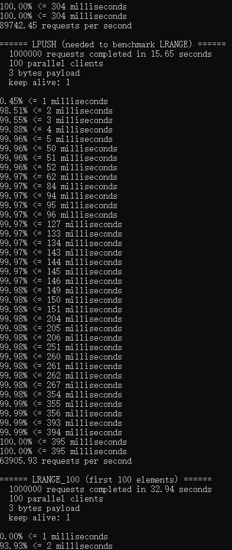
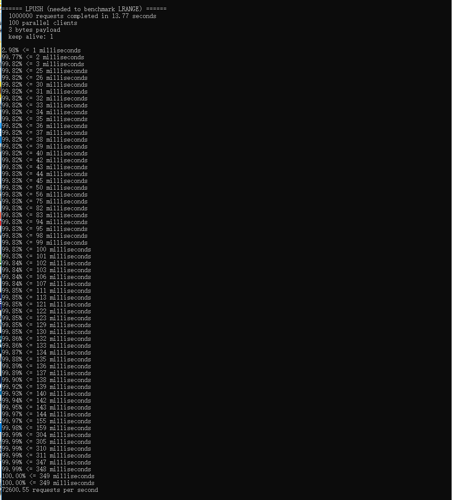

#  EF-Redis  

## 介绍

ef-Redis是java 版本的redis server

命令：仅支持服务连接与五大基本类型相关的命令

存储：仅支持AOF日志

多路复用：支持 epoll，kqueue，select 默认优先级由高到低，同时支持本地和单路复用

强烈推荐使用单路select线程模型
#### 解决问题

1,启动简单，方便测试

2,解除喜欢刨根问底的开发者，对大厂面试官面试redis相关问题的迷惑侧重点的迷惑

3,为redis proxy 开发提供技术参考

#### EF-Redis功能介绍

支持服务间的消息传递和数据共享

#### EF-Redis架构简介

集群架构方式：客户端路由

见作者知乎文档：

[微服务集群架构实现一览](https://zhuanlan.zhihu.com/p/368407754)

####  EF-Redis涉及技术

1,Netty

####  EF-Redis开发框架

Java+Netty

####  EF-Redis入门知识
1，Java基础

b站搜索 “韩顺平java”

2，Netty基础

b站搜索 “韩顺平netty”

3，redis tcp 协议

[RESP协议中文文档](https://www.redis.com.cn/topics/protocol.html)

[REDIS命令大全](https://www.redis.com.cn/commands.html)

[ef-redis 源码解析](https://zhuanlan.zhihu.com/p/434698347)

####  EF-Redis启动步骤

idea内部直接启动MyRedisServer

jar运行方式 ，参见ef-zab

####  EF-Redis AOf持久化演示

####  EF-Redis 如何连接？

redis-client 或者 redis-desktop-manager 都可以

###  EF-Redis 压测结果

####  秒吞吐量

同样资源下 EF-Redis秒吞吐量是Redis的70%-95%
将大部分redis data 缓存后 , 性能达到了redis的80%-95%

####  延迟

EF-Redis，与Redis相当

EF-Redis 0.5%的可能延迟超过100ms小于1s

Redis 基本稳定，100%小于12ms，0.5%的可能延迟超过2ms

➕ v 一起交流互联网

